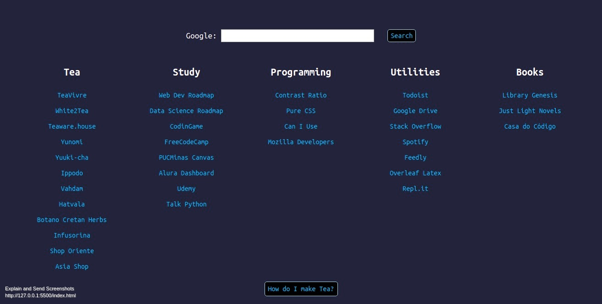

# PWA StartPage focused on links about tea and programming

This a page meant to be a responsive pwa startpage with some import links to myself and with a little table to help me calculate how to make tea on the style I want.

## Tea

On this you'll find links to some of the best tea vendors from China, Japan, India, Vietnan, Greece and Brazil.

## Study

Here you'll find some of the resources that I use to study.

## Programming

Here I put some links to some sites and tools that I use while programming.

## Utilities

Some links to sites and apps that I use on my day.

## Books

Links to sites that I use to download or buy books.

## How do I make tea?

A little table that shows how much tea you need, by 100ml, and how long you should steep to make your beverage on three different styles: western, half gongfu and gongfu.